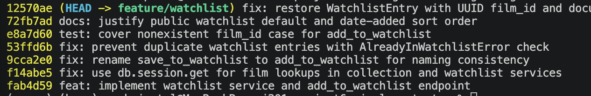

# PR Response Doc — CineLog Watchlist Feature

## AI Usage
## AI Usage
I used AI to check my commit history after rewriting it into conventional commit format. After rebasing onto main and cleaning up messages with `git rebase -i`, I asked the AI to review the final commit list against the project's contribution standards (feat/fix/test/docs prefixes, one logical change per commit, no merge commits) and flag anything that didn't fit and it caught that I'd misspelled a prefix on the rename commit, which isn't one of the allowed prefixes, so I changed it to `fix:` to match the standard. I made the actual judgment calls myself (what each commit's message should say, which prefix fit which change), but used the AI as a second pair of eyes to verify the final list matched the stated conventions before pushing.

## Comment 1 — Rename
**What I did:** Renamed save_to_watchlist() to add_to_watchlist() in services/watchlist_service.py, then updated the single call site in routes/watchlist/watchlist.py to use the new name.

**How I verified:** Used VS Code's Find All References on save_to_watchlist to confirm all changes were made and it couldn't be found anywhere else. Ran the full test pytest tests/ -v and all 4 tests passed.

## Comment 2 — Deduplication
**What I did:** Added the same deduplication pattern used in add_to_collection() from services/collection_service.py to add_to_watchlist() in services/watchlist_service.py. I made a new AlreadyInWatchlistError exception, then added a WatchlistEntry.query.filter_by(user_id=user_id, film_id=film_id).first() check to raise an AlreadyInWatchlistError if a matching entry already exists.

**How I verified:** I ran pytest tests/ -v and all tests passed and used AI to verify that the code in comparison to the original was compatible. 

## Comment 3 — Missing test
**What I did:** Created tests/test_watchlist.py and added test_add_to_watchlist_nonexistent_film_raises, mirroring test_add_to_collection_nonexistent_film_raises from tests/test_collection.py.One difference from the collection version: Film.id is an integer in this branch's models.py so I made the fake film_id is 999999 instead of a UUID string.

**How I verified:** I ran pytest tests/test_watchlist.py -v and it passed the test case. I also ran the pytest tests/ -v to make sure nothing else was affected. 

## Comment 4 — Default visibility
**My position:** I'm keeping `public=True` as the default for watchlist entries.

**Reasoning:** I believe that the point of Cinelog is to be like a social app. If watchlists are private by default it doesn't encourage sharing of your favorites. Apps like Instagram are private by default because they disclose names and sensitive info at time and users can decide if they want to share. Since this just gives thoughts on movies and lists, it's ok for the visibility to be public as long as its disclosed since discovery of different lists is part of the app similar to yelp.

**Tradeoff acknowledged:** Users may not realize their list is public even with a warning message as they may forget. It also runs the risk of people submitting opinions they'd rather keep private if they forget their thoughts are public. Much like spotify, it is important to make sure users are aware that they have to toggle this feature. Some users may prefer the default to be private but the social aspect of the app outweighs that in my opinion.

## Comment 5 — Sort order
**My position:** I will switch the sort order to date added for watchlit entries.
**Reasoning:** I believe users want to see when movies are added and also how recently others added posts. Things like current events or news about actors may sway opinions about movies and it's important to see what cultural context a movie was viewed in when it was reviewed. I believe users also want to share their most recently watched movies, as generally media like movies operates more on recency in popularity. 
**Engagement with reviewer's point:** I agree with the reviewer generally due to my reasoning above. A potential counterargument is that users with over 100 movies may want to be able to search by name instead of when they watched it but I'm making a base assumption that recency is more important and a new filter to sort alphabetically could be added later after we gain users and maintain the service long enough for users to actually hit large numbers of movies. One thing to note is that if users want to backdate when they saw a movie, it shouldn't just default to the day the review was written.

## Comment 6 — Rebase
**What conflicted:** I ran git fetch origin and git rebase origin/main. The first  conflict was in .gitignore because both branches had one so I merged them into a single list. The other was main's UUID-refactor commit (07ca580) had deleted the entire WatchlistEntry model from models.py since main never had the watchlist feature to begin with. After the rebase completed, models.py had no WatchlistEntry class at all even though services/watchlist_service.py still imported and used it.

**How I resolved it:** For the .gitignore conflict, I manually merged both lists and removed the conflict markers, then ran git add .gitignore and git rebase --continue. After the rebase finished, I manually re-added WatchlistEntry to models.py, changing film_id from db.Integer to db.String(36) so it matches the UUID type now used by Film.id and CollectionEntry.film_id. I also updated the remaining references like the film_id docstring in add_to_watchlist() (now describes a UUID string instead of an int), and the fake_film_id in tests/test_watchlist.py, which I changed from 999999 to a UUID-shaped string "00000000-0000-0000-0000-000000000000" to match the new type.

**How I verified no conflict remains:** Ran git log --oneline --merges feature/watchlist and confirmed the only merge commit present (bbe206c) predates my branch and belongs to main's own history so no new merge commit was introduced and we can confirm the rebase produced a linear history rather than a merge. I ran pytest tests/ -v and all tests passed. Pushed with `git push --force-with-lease origin feature/watchlist` since the rebase rewrote my commit history.

## PR Description
## Overview
Adds a watchlist feature, letting users save films they want to watch later, separate from their collection (films already watched). 

## Design decisions

- **Default visibility:** Watchlist entries default to public=True full reasoning and the acknowledged privacy tradeoff are in pr-response.md comment 4.
- **Sort order:** `get_watchlist()` sorts by date added (most recent first) rather than alphabetically, matching `get_collection()`'s convention and the recency-driven nature of a "want to watch" queue. Tradeoffs around long-list scannability are documented in pr-response.md under comment 5.

## Manual testing
1. `pip install -r requirements.txt`
2. `pytest tests/ -v` — all tests should pass (collection + watchlist).
3. Run the app locally, then:
   - `POST /watchlist/<user_id>/add` with `{"film_id": "<uuid>"}` — should create an entry (201).
   - Repeat the same request — should return 409-equivalent behavior via `AlreadyInWatchlistError` (currently unhandled at the route level — see open item below).
   - `GET /watchlist/<user_id>` — should return films sorted newest-added first.

